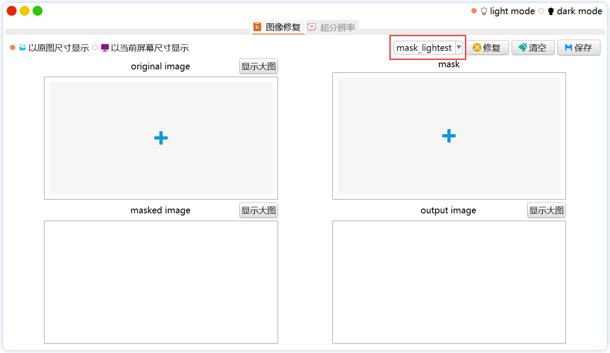

# Inpainting-Cpp-Deployment

这是一个用于图像修复的桌面软件，是图像修复算法在Windows10上的**C++部署**，基于**C++17**，使用vs2019实现。

图像修复算法使用了**LibTorch+OpenCV**实现，界面使用了**Qt**实现，其中暂时只实现了一种图像修复算法：[Image Inpainting for Irregular Holes Using Partial Convolutions](https://arxiv.org/abs/1804.07723)[Liu+, arXiv2018].，但可作为基础框架进行算法部署的拓展。

# 需要的库

```shell
Libtorch-win-shared-with-deps-debug-1.9.1+cu102

Opencv4.5.0

Qt5.14.2

Visual Studio Profeesional 2019-16.11.1
```

# 生成和运行

1. 下载Libtorch模型文件，[Extract Code: 3tcn](https://pan.baidu.com/s/1Ljqr46-MdKFQ40mpb1zurw)，放在`./Inpainting/model`文件夹下，目录如下：

   ```shell
   ├─demo
   ├─icons
   ├─images
   ├─input
   ├─model
   │  ├─partialconv_16.8.pt
   │  ├─partialconv_23.55.pt
   │  └─partialconv_35.5.pt
   ├─output
   ├─stylesheets
   └─x64
   ```

   

2. 在Visual Studio 2019上部署Libtorch、Opencv和Qt的环境，关于libtorch、opencv4在vs2019上的部署，查阅网上相关的教程和博客，期间需要包含各种路径和dll。

   建议在部署成功后将`.lib`和`.dll`文件的路径等写在同一个`.props`文件里，然后每次创建项目在vs的Property Manager里直接`Add Existing Property Sheet`，避免重复配置的麻烦。

3. 在vs新建一个qt项目并复制源代码，或直接打开`Inpainting.sln`。选择语言标准为`C++17`，模式为`Debug-x64`，先右键点击`Inpainting.ui`和`InpaintingSubwindow.ui`文件，进行compile，之后点击Debugger即可运行

# Demo


# 完成的工作

- [x] 使用Libtorch加载从pytorch导出来的C++模型，完成前向推理（关于libtorch模型导出，请参考[这里](https://github.com/NiceRingNode/PartialConvolution/pytorch2libtorch.py)）

- [x] 使用Opencv和Libtorch对图像进行预处理和后处理，实现包含在头文件[PConvApplication.h](https://github.com/NiceRingNode/Inpainting-Cpp-Deployment/Inpainting/PconvApplication.h)和.cpp文件[PConvApplication.cpp](https://github.com/NiceRingNode/Inpainting-Cpp-Deployment/tree/main/Inpainting/PConvApplication.cpp)中

- [x] Qt实现了（部分使用Qss）：

  - 无边框窗口，包括缩放、移动、阴影、圆角

  - 黑夜模式和白天模式
  - 仿mac窗口的关闭、放大、最小化按钮


- [x] 切换不同的模型，使阴影面积占比不同的mask可以和对应的权重结合进行推理（关于不同阴影面积占比的比较，请参考本人对原论文的[复现](https://github.com/NiceRingNode/PartialConvolution)）

  

# 需要改进的点

因为训练的模型要求输入的图片和mask大小为256×256，故输入大面积的图片（比如1330×1330）经过缩放（缩小到256×256之后又放大到1330×1330）使得图像变得很模糊。经过测试，使用qt缩小再用qt放大的效果最好（其他的方案分别是使用opencv缩小/放大与qt缩小/放大进行匹配），虽然依然会使得图片模糊。

如果先将图片缩小到512×512再放大到1330×1330，效果会好很多，但是由于训练时使用的图片和mask的大小为256×256，无法输入更大的图片或者mask。所以需要重新在voc或coco数据集里筛选更大一点的图片，配合更大的mask，来训练新的权重，用更大的图片可以缓解这个问题.

# 踩的坑（比较大的几个）

1. libtorch编译不要用超过cpp17

2. qt和libtorch的slots宏定义冲突，解决办法是

   ```c++
   #undef slots
   #include"torch/torch.h"
   #include"torch/script.h"
   #define slots Q_SLOTS
   ```

3. 模型加载失败，要么是路径不对，要么是没有在linker的command line加cuda的命令`/INCLUDE:?warp_size@cuda@at@@YAHXZ`

4. QScrollArea中的QLabel缩放，应该用最外层的QScrollArea来计算宽高，而不是取QLabel的width()和height()，因为后者会不断重新求值，如下图，缩放会特别慢

   

   如果直接用最外层的QScrollArea计算宽高，会立即缩放，如下图

   

