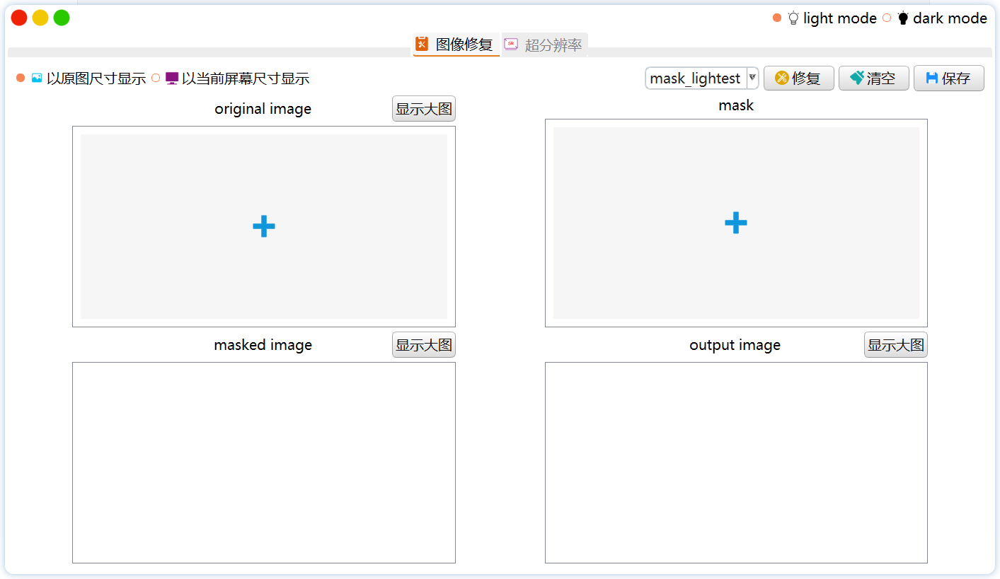
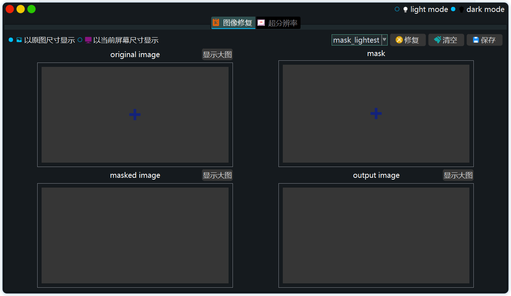
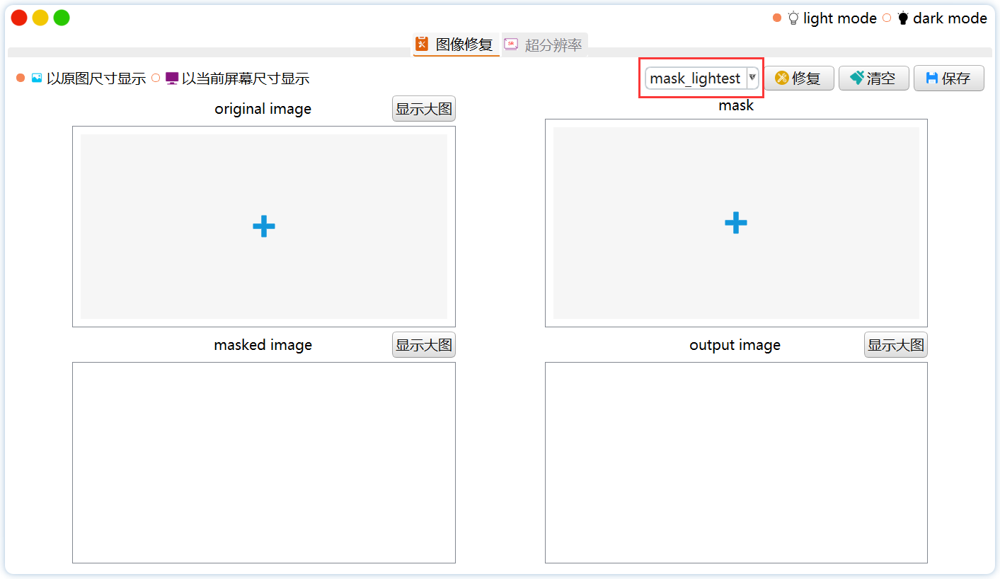
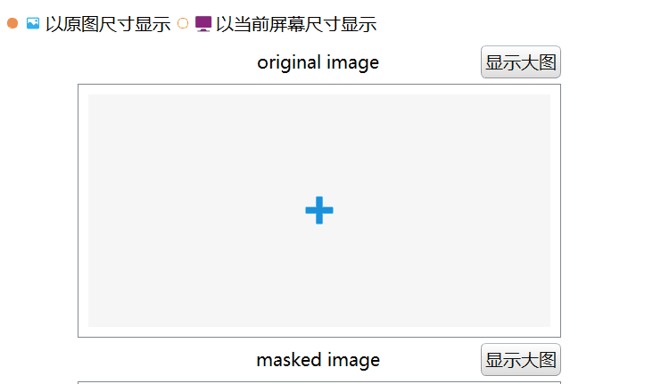

# Inpainting-Cpp-Deployment

[中文版在这里>>>>>>>>>>](./Inpainting/demo/README-中文版.md)

This is a desktop software for image inpainting. It is a **C++ deployment** of image inpainting algorithm on Windows10, based on **C++17** and implemented using vs2019.

The image inpainting algorithm is implemented using **LibTorch+OpenCV**, and the interface is implemented using **Qt**. For the time being, only one algorithm is implemented: [Image Inpainting for Irregular Holes Using Partial Convolutions](https:// arxiv.org/abs/1804.07723)[Liu+, arXiv2018]., but it can be used as a basic framework to expand algorithm deployment.

# Requirements

```shell
Libtorch-win-shared-with-deps-debug-1.9.1+cu102

Opencv4.5.0

Qt5.14.2

Visual Studio Profeesional 2019-16.11.1
```

# Build

1. Download libtorch models, [Extract Code: 3tcn](https://pan.baidu.com/s/1Ljqr46-MdKFQ40mpb1zurw), and put them in this folder: `./Inpainting/model`. Whole directory should look like this.

   ```shell
   ├─demo
   ├─icons
   ├─images
   ├─input
   ├─model
   │  ├─partialconv_16.8.pt
   │  ├─partialconv_23.55.pt
   │  └─partialconv_35.5.pt
   ├─output
   ├─stylesheets
   └─x64
   ```

2. Deploy Libtorch, Opencv and Qt on Visual Studio 2019. 

   For the environment configuration of libtorch and opencv4 on vs2019, please refer to relevant online tutorials and blogs.

   It is recommended to write the path of `.lib` and `.dll` files in the same `.props` file after successful deployment, and then directly `Add Existing Property Sheet` in the Property Manager of vs, which would help avoid configuring repeatedly.

3. Create a new qt project in vs and copy the source code, or open `Inpainting.sln` directly. Select the language standard as `C++17` and the mode as `Debug-x64`. Then right-click the form files `Inpainting.ui` and `InpaintingSubwindow.ui`  to compile, and then click Debugger to run the codes.

# Demo


# Works

- [x] Using libtorch to load the C++ model exported from pytorch and completes inference (for libtorch model export, please refer to [this](https://github.com/NiceRingNode/PartialConvolution/pytorch2libtorch.py)

- [x] Using Opencv and Libtorch to finish image pre-process and post-process. The implementation is included in the header file [PConvApplication.h](https://github.com/NiceRingNode/Inpainting-Cpp-Deployment/Inpainting/PconvApplication.h) and the .cpp file [PConvApplication.cpp](https://github.com/NiceRingNode/Inpainting-Cpp-Deployment/tree/main/Inpainting/PConvApplication.cpp)

- [x] Using Qt to implement (partially using Qss):

  - Frameless window, including zoom, move, shadow, rounded corners

  - Dark-mode and light-mode
  - Close, zoom in, and minimize buttons, style imitating mac





- [x] 切换不同的模型，使阴影面积占比不同的mask可以和对应的权重结合进行推理（关于不同阴影面积占比的比较，请参考本人对原论文的[复现](https://github.com/NiceRingNode/PartialConvolution)）

  

# To be Improved

As the pre-trained model requires the input image and mask size to be 256×256, if the input area is larger than 256×256 (such as 1330×1330), after zooming (reduced to 256×256 and then enlarged to 1330×1330), the image will become very blurred. After testing, using `QPixmap.scaled()` to zoom out and then using `QPixmap.scaled()` to zoom in can minimize blurring (other solutions are to use `cv::resize()` to zoom in/out and `QPixmap().scaled()` zoom in/out to match), but it cannot completely make the blur disappear.

If the picture is reduced to 512×512 and then enlarged to 1330×1330, the blur will be reduced a lot. However, since the size of the picture and mask used in training is 256×256, it is impossible to input a larger picture or mask. Therefore, if interested,  using larger images and larger masks to train new weights would help reduce blur due to zooming.

# Falls into the pit

1. When compiling, **do not** use C++ standard over C++17, otherwise the compilation of libtorch would fail.

2. The `slots` macro definition conflicts between qt and libtorch, the solution is

   ```c++
   #undef slots
   #include"torch/torch.h"
   #include"torch/script.h"
   #define slots Q_SLOTS
   ```

3. if the libtorch model loading fails, the reason will either be the path is wrong, or the cuda command `/INCLUDE:?warp_size@cuda@at@@YAHXZ` is not added to the command line of the linker.

4. QScrollArea中的QLabel缩放，应该用最外层的QScrollArea来计算宽高，而不是取QLabel的width()和height()，因为后者会不断重新求值，如下图，缩放会特别慢

5. The QLabel scaling in QScrollArea should use the outermost QScrollArea to calculate the width and height instead of QLabel's width() and height(), because the latter will continue to be re-evaluated, as shown below, which makes the image scale in an **ultra slow speed**.

   

   If directly using the outermost QScrollArea to calculate the width and height, it will zoom immediately, as shown below

   

